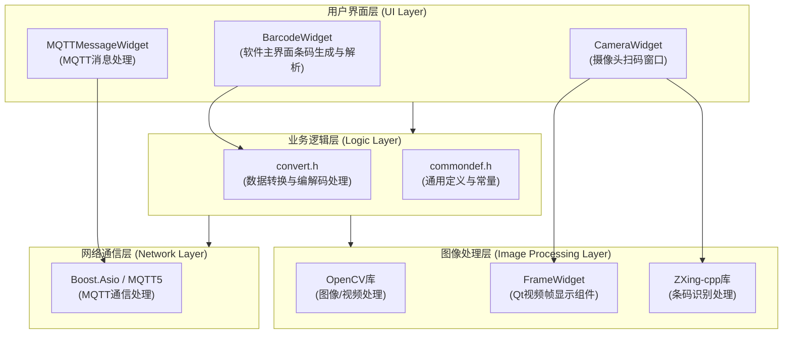

# 软件设计文档

## 软件功能

软件的功能核心就是处理条形码，包括生成和识别两大模块。

- **条码生成**
  - 上传普通文本文件生成条码图片
  - 手动输入文本生成条码图片
  - 上传二进制文件生成条码图片
  - 批量生成条码图片，具体为支持多选文件上传生成对应条码图片
  - 支持生成多种条码格式

- **解析条码**
  - 上传条码图片文件进行解析
  - 批量解析条码图片，具体为支持多选图片文件上传进行解析
  - 解析结果导出为文本文件或显示在界面上
  - 支持多种条码格式的解析

- **打开摄像头扫码**
  - 基于 OpenCV、ZXing-cpp 实现摄像头实时扫码功能，并且识别到条码会自动在视频预览中圈出
  - 支持选择不同的摄像头设备及分辨率
  - 支持将扫描结果导出为 HTML 和 XLSX 文件

- **其他功能**
  - **系统信息显示**：在关于界面显示当前操作系统的版本、内核版本及架构信息
  - **全局字体配置**：支持通过配置文件自定义软件全局字体，适配不同显示环境

---

"*打开摄像头扫码*"事实上也是属于解析条码功能一类，不过它被视作为独立的重要功能，在代码中也是独立模块的，所以我们单独分开来。

不管是生成还是解析，软件都支持以下 19 种条码，也就是 zxing-cpp 所支持的条码类型：

| 商品一维码        | 工业一维码         | 二维矩阵            |
| --------------- | ----------------- | ------------------ |
| UPC-A           | Code 39           | QR Code            |
| UPC-E           | Code 93           | Micro QR Code      |
| EAN-8           | Code 128          | rMQR Code          |
| EAN-13          | Codabar           | Aztec              |
| DataBar         | DataBar Expanded  | DataMatrix         |
| DataBar Limited | DX Film Edge      | PDF417             |
|                 | ITF               | MaxiCode (partial) |

## 技术架构说明

- **界面框架**：基于 Qt 进行界面绘制与用户交互
- **图像与视频处理**：使用 OpenCV 实现图像加载、摄像头捕获与画面标注
- **条码处理引擎**：全部条码的生成与解析均依赖 ZXing-cpp 库实现
- **兼容性与限制**：条码生成与解析的功能边界、识别成功率及支持的数据格式，**均由 ZXing-cpp 库及其所遵循的条码国际标准决定**。

## 软件代码架构

系统采用模块化设计，主要分为以下几个核心模块：

### 核心组件说明

#### 1. 用户界面层

- [BarcodeWidget](../src/BarcodeWidget.h)：
  - 主界面组件，负责条码生成和解析功能的UI交互
- [CameraWidget](../src/CameraWidget.h)：
  - 摄像头扫码功能界面组件，负责视频捕获、实时扫码、参数配置及结果导出
- [MQTTMessageWidget](../src/mqtt/MQTTMessageWidget.h)：
  - MQTT消息处理界面组件，用于远程消息监控

#### 2. 业务逻辑层

- [convert.h](../src/convert.h#L11-L140)：
  - 核心数据转换模块，包含文件编码/解码、图像处理等功能
- [commondef.h](../src/commondef.h)：
  - 通用定义和常量声明

#### 3. 图像处理层

- [FrameWidget](../src/FrameWidget.h)：
  - 专门用于显示视频帧的Qt组件
- [OpenCV](https://github.com/opencv/opencv)：
  - 负责图像加载、保存、摄像头视频流捕获等底层图像处理
- [zxing-cpp](https://github.com/zxing-cpp/zxing-cpp)：
  - 负责条码的生成和识别算法实现

#### 4. 网络通信层

- Boost.Asio/MQTT5：负责MQTT协议通信，实现远程消息订阅和发布功能（详情见 [mqtt文档](./mqtt.md)）

#### 5. 其他组件

- [UiConfig](../src/components/UiConfig.h)：
  - 用于存储和管理软件的字体配置，项目所有字体相关设置应该从 `Ui::getAppFont()` 获取，不应该直接在其他地方硬编码字体
- [message_dialog](../src/components/message_dialog.h)：
  - 用于显示消息对话框的组件，提供统一的消息提示界面
- [about_dialog](../src/about_dialog.h)：
  - 用于显示软件关于信息的对话框，包含版本号、作者及系统环境信息
